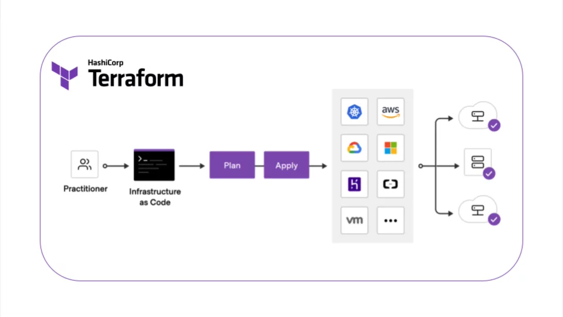

# Terraform Certification 
- [Link](https://learn.hashicorp.com/tutorials/terraform/associate-review?in=terraform/certification) to HashiCorp Official Exam Prep Material

### What is Terraform?
- A tool used to define infrastructure in human and machine-readable code. 



### What is IaC (Infrastructure as code)?
- Infrastructure (CPUs, Memory, Disk, Firewalls, etc.) defined as code within definition files. 
- Virtual Computation of the infrastructure has enabled the ability to build and apply configuration changes to infrastructure via software commands. Modern tools allow for simplified code, testing can apply and track changes between iterations, reuse components of code across different projects. 

### IaC Lifecycle
- Can be applied throughout the lifecycle, both on the initial build and throughout the life of the infrastructure. Day 0 code provisions and configures the initial infrastructure, and Day 1 refers to OS and application configurations you apply after the initial infrastructure build.
- IaC makes it easy to provision and apply infrastructure configurations, saving time. Standardizes workflows across different providers such as VMware, AWS, Azure, GCP by using a common syntax across all of them. 
- IaC makes it easy to understand the intent of infrastructure changes, because it can span multiple files, allowing human operators to organize the code based on the intent. E.g., an operator could create different files to define different infrastructure components or separate variables definitions from execution blocks without affecting the execution. 
- Terraform includes libraries of providers and modules to make it easy to write the code to provision and apply configurations. 

### IaC Reliability 
- IaC makes changes idempotent, consistent, repeatable, and predictable. Without IaC, scaling up infrastructure to meet increased demand may require an operator to remotely connect to each machine and then manually provision and configure many servers by executing a series of commands/scripts. Multiple sessions and movement between screens maybe required and could result in skipped steps or slight variations between how work is completed, necessitating roll backs. Perhaps a command was run incorrectly on one instance and reverted before being re-run correctly. 
- These process inconsistencies can result in slight differences between servers that compound over time and could impact their performance, usability, or security. If a large team is applying changes, the risks increase because individuals don’t always follow the same instructions identically. 
- IaC allows for testing and reviewing results before the code is applied to out target environments. Should a result not align to expectations, we iterate on the code until the results pass our tests and align to out expectations. Once the code is ready, we can apply the code via automation at scale ensuring consistency and repeatability in how it is applied. 


### IaC is Manageable
- Terraform provides benefits that enable mutation, when necessary, via code. E.g., an environment has been provisioned that contains a couple servers and a load balancer. To address increased load, additional servers are needed. The IaC can be revised, with minimal changes, to bring new servers online using the previously defined configuration.
- During execution, terraform will examine the state of the currently running infrastructure determine what differences exist between the current state and the revised desired state and indicate the necessary changes that must be applied. When approved to proceed, only the necessary changes will be applied, leaving existing, valid infrastructure untouched. 

## Terraform
- What is it?
    - IaC tool which allows you to define both cloud and on prem resources in human-readable configuration files that you can version, reuse, and share. A consistent workflow can be used to provision and manage the entire infrastructure throughout its lifecycle. Terraform can manage low level components like compute, storage, and networking resources as well as high level components like DNS entries and SaaS features. 

- How Does it work?
    - Terraform creates and manages resources on cloud platforms and other services through their application programming interfaces (APIs). Providers enable Terraform to work with virtually any platform or service with an accessible API. 
    - Terraform has a registry which has publicly available resources and services, includes AWS, Azure, Google Cloud Platform, Kubernetes, Helm, GitHub, Splunk, DataDog and many more. 
    - Core Terraform Workflow consists of 3 stages:
        - Write: Define resources, which may be across multiple cloud providers and services. E.g., Creating a configuration to deploy an application on virtual machines in a VPC network with security groups and a load balancer.
        - Plan: Terraform creates an execution plan describing the infrastructure it will create, update, or destroy based on the existing infrastructure and you configuration. 
        - Apply: On approval, terraform performs the proposed operations in the correct order, respecting any resource dependencies. E.g., if you update the properties of a VPC and change the number of virtual machines in that VPC, terraform will recreate the VPC before scaling the virtual machines.
    - Track infrastructure
        - Terraform generates a plan and prompts you for your approval before modifying your infrastructure. It also keeps track of your real infrastructure in a state file, this file acts as a source of truth for your environment. Terraform uses the state file to determine the changes to make your infrastructure so that it will match your configuration.
    - Automate Changes
        - Terraform configurations files are declarative, meaning they describe the end state of your infrastructure. Terraform builds a resource graph to determine resource dependencies and creates or modifies non – dependent resources in parallel, allowing terraform to provision resources efficiently.
    - Standardizes Configurations
        - Terraform supports reusable configuration components called modules that define configurable collections of infrastructure, saving time and encouraging best practices. You can use publicly available modules from the terraform registry. 

## Use-Cases: 
- Multi-Cloud Deployment
    - Provisioning infrastructure across multiple clouds increases fault-tolerance, allowing for more graceful recovery from cloud provider outages. 
    - Multi-Cloud deployments add complexity because each provider has its own interfaces, tools, and workflows. Terraform allows you to use the same workflow to manage multiple providers and handle cross cloud dependencies, which simplifies management and orchestration for large-scale, multi-cloud infrastructures. 
- Self-Service Clusters
    - Self-serve infrastructure model can be used to let product teas manage their own infrastructure independently. Can create Terraform modules which codify standards for deploying and managing services in your organization, allowing teams to efficiently deploy services in compliance with your organization’s practices. Terraform cloud can integrate a ticketing system to automatically generate new infrastructure requests.
- Policy Compliance and Management
    - Sentinels is a policy-as-code framework which can automatically enforce compliance and governance policies before Terraform makes infrastructure changes. 
- Kubernetes
    - Terraform allows you to deploy a Kubernetes cluster and manage its resources.


## Terraform State
- State acts as a sort of database to map Terraform config to the real world.
- Terraform is responsible for creating objects and recording their identities in the state. 
-  Metadata:
    - Alongside the mappings between resources and remote objects. Terraform must also track metadata such as resource dependencies.
    - Terraform uses configuration to determine dependency order. However, when you delete a resource from Terraform configuration, terraform must know how to delete said resource. Terraform retains a copy of the most recent set of dependencies within the state. Terraform can now determine the correct order for destruction from the state when you delete one or more items from the configuration. 
    - Terraform must understand the ordering of semantics of every resource of every cloud and understand ordering across providers. For example, terraform could know that servers must be deleted before the subnets they are a part of.
- Performance
    - Terraform stores a cache of the attribute values for all resources in the state. 
    - When running terraform plan, terraform must know the current state of resources to effectively determine the changes that it needs to make to reach your desired configuration. 
    - For small infrastructures, terraform can query providers and sync the latest attributes from all your resources. For every plan and apply, terraform will sync all resources in your state. 
    - For larger infrastructures, querying every resource is too slow. Many cloud providers do not provide APIs to query multiple resources at once, and the round trip time for each resource is hundreds of milliseconds. On top of this, cloud providers almost always have API rate limiting so Terraform can only request a certain number of resources in a period. Larger users of Terraform make heavy use of the -refresh=false flag as well as the -target flag to work around this. 

- Syncing
    - In default configuration, Terraform stores the state in a file in the current working directory where Terraform was run. However, when using Terraform as a team it is important that all members are working with the same state so that operations will be applied to the same remote objects.
    - Remote state is the recommended solution to this problem. With a fully featured state backend, terraform can use remote locking as a measure to avoid two or more different users accidently running Terraform at the same time, and thus ensure that each Terraform run begins with the most recent updated state. 


## Terraform Providers
- Terraform can interact with cloud providers, SaaS providers and APIs.
- Terraform provides documentation on how to configure and declare specific providers. 
- To declare the providers in terraform a provider block is required where a project name is given and the specific region where the project should be set up. 
```
provider "google" {
  project = "acme-app"
  region  = "us-central1"
}
```
- `alias` Multiple Configuration for Providers
    - Provider blocks can contain the alias argument which allows for multiple configurations for the same provider, this allows support for providres to be setup in multiple regions for a cloud platform.
```
# The default provider configuration; resources that begin with `aws_` will use
# it as the default, and it can be referenced as `aws`.
provider "aws" {
  region = "us-east-1"
}

# Additional provider configuration for west coast region; resources can
# reference this as `aws.west`.
provider "aws" {
  alias  = "west"
  region = "us-west-2"
}
``` 
- The default configuration is set for the provider if no alias is mentioned. 
- When referring to the provider configuration, the reference will be in the form `<PROVIDER NAME>.<ALIAS>, for example in the above snippet we would refer to the provider config for us-west-2 as `aws.west`.

## Terraform CLI Commands
- `terraform fmt [options] [DIR]` used to rewrite Terraform configuration files to a canonical format and style.
    - Command line flags for `terraform fmt`:
    - `-list=false` Dont list the files containing formatting inconsistencies 
    - `-write=false` Dont overwrite the input files. 
    - `-diff` Displays diffs of formatting changes
    - `-check` Check if the input is formatted. Exit status will be 0 if all input is properly formatted and non-zero otherwise
    - `-recursive` Also process files in subdirectories. By default, only the given directory is processed. 
- `terraform taint` command informs Terraform that a particular object has become degraded or damaged. Object is marked as 'tainted' in the Terraform state, Terraform will propose to replace it in the next Terraform plan you create. 
- `terraform import [options] ADDRESS ID` command is used to import existing resources into Terraform. Import an existing infrastructure into your terraform state.  
    - import will find the existing resource from ID and import it into your Terraform state at the given ADDRESS
    - ADDRESS must be a valid resource address. Resources are imported into modules and into the root of your state.
    - Command line flags for `terraform import`:
        - `-config=path` Path to directory of Terraform configuration files that configure the provider for import. Defaults to working directory. If this directory contains no Terraform config files the provider must be configured via manual input or environmental variables. 
        - `-input=true` Whether to ask for input for provider configuration
        - `-lock=false` Dont hold a state lock during operation. Can be dangerous if others concurrently run commands against the same workspace.
        - `-lock-timeout=0s` Duration to retry a state lock
        - `-no-color` If specified, output wont contain any colour
        - `-parallelism=n` Limit the number of concurrent operation as Terraform wals the graph
        - `-provider=provider` Deprecated override the provider configuration to use when importing the object. By default, Terraform uses the provider specified in the configuration for the target resource and that is the best behavior in most cases.  
        - `-var foo=bar` Set a variable in the Terraform configuration. 
        - `var-file=foo` Set variables in the Terraform configuration from a variable file. 


## Workspaces
- Each Terraform configuration has an associated backend that defines how operations are executed and where persistent data such as the Terraform state are stored. 
- Persistent data stored in the backend belongs to a workspace, usually it is the default workspace with one Terraform state associated with that configuration.
- Certain backends support multiple named workspaces, allowing multiple states to be associated with a single configuration. The configuration still has only one backend, but multiple instances of that configuration to be deployed without configuring a new backend or changing authentication credentials. 
- Multiple workspaces are currently supported by the following backends:
    - AzureRM
    - Consul
    - COS
    - etcdv3
    - GCS
    - Kubernetes
    - Local
    - Manta
    - Postgres
    - Remote
    - S3

###### Using Workspaces 
- Terraform starts with the default workspace, which can never be deleted.
- Mangaged by the `terraform workspace` command, to create a new workspace `terraform workspace new` and run `terraform workspace select new` to switch to the new workspace.  
- When running `terraform plan`, Terraform will be unbale to see existing resources that existed in the default workspace, the resources still exist but are managed in another workspace. 

###### Current Workspace Interpolation
- You can specify the name of the current worspace within the Terraform configuration using `${terraform.workspace}` interpolation sequence. This is useful for chaning behavior based on the workspace. 

###### When to use Multiple Workspaces
- Common use of multiple workspaces is to create a parallel, distinct copy of a set of infrastructure in order to test a set of changes before modifying the main production infrastructure. For example, a developer working on a complex set of infrastructure changes might create a new temporary workspace in order to freely experiment with changes without afecting the default workspace. 
- Non -defualt workspaces are often related to feature bramches in version control. The default workspace might correspond to the "main" branch. A feature branch is created a develop a change, the developer of that feature can create a corresponding workspace and deploy a temporary copy of the main infrastructure so changes can be tested without affecting the production infrastructure. Once the change is merged and deployed to the default workspace, the test infrastructure can be destroyed and the temprorary workspace deleted. 
- Terraform is used to manage larger systems, teams should use multiple seperate Terraform configurations that correspond with suitable architectural boundaries within the system so that different components can be managed serperatley and by distinct teams. 
- Workspaces alone are not a suitable tool for system decomposition, because each subsystem should have its own seperate configuration and backend and will thus have its own distinct set of workspaces. 
    - Organizations commonly want to create a strong seperation between multiple deployments of the same infrastructure serving different development stages such as staging vs production, or different internal teams. In this case the backend used for each deployment often belongs to that deployment, with different credentials and access controls. Names workspaces are not a suitbale isolation mechanism for this scenario.  
    - Instead you can use re-usable modules to represent the common elements and then represent each instance as a serperate configuration that instantiates those common elements in the context of a different backend. In that case the root module of each configurations will consist only of a backend configuration and a small number of `module` blocks whose arguments describe any small differences between the deployments. 
    - Multiple configurations are representing distinct system components rather than multiple deployments data can be passed from one component to another using paired resources types and data sources. For Example:
        - Where a shared consul cluster is available, use `consul_key_prefix` to publish to the key/value store and `consul_keys` to retrieve those values in other configurations. 
        - In systems that support user-defined labels or tags, use a tagging convention to make resources automatically discoverable. E.g. use the `aws_vpc` resource type to assign suitable tags and then the `aws_vpc` data source to query by those tags in other configurations. 
        - For server addresses use a provider specific resource to create a DNS record with a predictable name and then either use that name directly or use the `dns` provider to retrieve the published addresses in other configurations. 
        - If a Terraform state for one configuration is stored in a remote backend that is accessible to other configurations then `terraform_remote_state` can be used to directly consume its root module outputs from those other configurations. This creates a tighter coupling between configurations, but avoids the need for the "producer" configurations to explicity publish its result in a serperate system. 

###### Workspace Internals 
- Workspaces are technically equivalent to renaming your state file. Terraform wraps this simple notion with a set of protections and support for remote state.
- For local state, Terraform stores the workspace states in a directory called `terraform.tfstate.d`. This directory is treated similarly to local-only `terraform.tfstate`; some teams commit these files to version control, although using a remote backend instead is recommended when there are multiple collaborators.
- For remote state, the workspaces are stored directly in the configured backend. E.g. if you use Consul, the workspaces are stred by appending the workspace name to the state path. To ensure that workspace names are stored correctly and safely in all backends, the name must be valid to use in a URL path segment without escaping. 
- Workspaces are meant to be a shared resource. The 'current workspace' name is stored only locally in the ignored `.terraform` directory. This allows multiple team members to work on different workspaces concurrently. The 'current workspace' name is not currently meaningful in Terraform Cloud workspaces since it will always have the value `default`.  

## State Command
- `terraform state` command is used for advanced state management, any modifications should be made using the `terraform state` command.

###### Usage
- Usage: `terraform state <subcommand> [options] [args]`
- List of the subcommands that can be used with `terraform state`:
    - Inspecting State:
        - `terraform state list` command shows the resource addresses for evry resource Terraform knows about in a configuration, optionally filtered by partial resource address.
        - `terraform state show` command displays detailed state data about one resource
        - `terraform refresh` command updates state data to match the real world condition of the managed resources. This is done automatically during plans and applies, but not when interacting with state directly. 
    - Tainting:
        - `terraform taint` command tells Terraform to destroy and re-create a particular resource during the next apply, regardless of whether its resource arguments would normally require that.
        - `terraform untaint` command undoes a previous taint or can preserve a resource that was automatically tainted due to failed provisoners. 
    - Moving Resources
        - `terraform state mv` command changes which resource address in your configuration is associated with a particulr real-world object. Use this to preserve an object when renaming a resource or when moving a resource into or out of a child module 
        - `terraform state rm` command tells Terraform to stop managing a resource as part of the current workinf directory and workspace, without destroying the corresponding real-world object. (You can later use `terraform import` to start managing that resource in a different workspace or a different Terraform configuration)
        - `terraform state replace-provider` command transfers existing resources to a new proivder without requiring them to be re-created. 
    - Disaster Recovery
        - `terraform force-unlock` command can override the protections Terraform uses to prevent two processes from modifying state at the same time. You ight need this if a Terraform process, such as apply, is unexpectedly terminated before it can release its lock on the state backend. Do not run this until you are completely certain what happened to the process that caused the lock to get stuck. 
        - `terraform state pull` command and the `terraform state push` command can directly read and write etire state files from and to the configured backend. You might need this for obtaining or restoring a state backup. 

###### Remote State
- Terraform state subcommands all work with remote state just as if it was local state. Reads and writes may take longer than normal as each read and write do a full network roundtrip. Otherwise, backups are still written to disk and the CLI usage is the same as if it were local state. 

###### Backups 
- All `terraform state` subcommands that modify the state write backup files. The path of these backup file can be controlled with `-backup`
- Subcommands which are read-only such as list do not write any backup files since they are'nt modifying the state. 

## Debugging Terraform
- Logs can be enabled by setting the `TF_LOG` environment variable to any value, detailed logs will appear on stderr.
- `TF_LOG` Can be set to one of the log levels, `TRACE`, `DEBUG`, `INFO`, `WARN`, or `ERROR` to change the verbosity of the logs. 
- Setting `TF_LOG` to `JSON` outputs logs at the `TRACE` level or higher, and uses a parseable JSON encoding as the formatting. 
- Logging can be enabled seperately for terraform itself and the provider plugins using the `TF_LOG_CORE` or `TF_LOG_PROVIDER` environment variables. These take the same level arguments as `TF_LOG`, but only activate a subset of the logs. 
- To persist logged output you can set `TF_LOG_PATH` in order to force the log to always be appended to a specific file when logging is enabled. Note that even when `TF_LOG_PATH` is set, `TF_LOG` must be set in order for any logging to be enabled.
- If a bug is encountered with Terraform, attach the detailed log by using a service such as gist. 

## Modules 
- A module is a container for multiple resources that are used together.
- Terraform Registry makes it simple to find and use modules
- Every Terraform configuration has at least one module, known as its root module, which consists of the resources defined in the `.tf` files in the main directory. 

###### Using Modules
- Terraform Registry is integrated directly into Terraform, therefore a Terraform configuration can refer to any module published in the registry. Syntax for specifying a registry module is `<NAMESPACE>/<NAME>/<PROVIDER>`, e.g. `hashicorp/consul/aws`. `terraform init` will download and cache any modules refernced in the configuration.
```
module "consul" {
    source = "hashicorp/consul/aws"
    version = "0.1.0"
}
```
- Modules from a private registry can also be used such as the ones provided by terraform cloud, private registry modules have source string similar to the public registry but with the added host name prefix, `<HOSTNAME>/<NAMESPACE>/<NAME>/<PROVIDER>`. 
- Modules also come with documentation in case any extra configuration is required such as credentials.

###### Module Blocks

###### Calling a Child Module
- The main Terraform module which is known as the root module of a configuration can call other modules into the configuration. A module that has been called by another module is referred to as the child module. 
- To call a module means to include the contents of that module into the configuration with specific values for its input variables. Modules are called from within other modules using `module` blocks:
```
module "servers" {
    source = "./app-cluster"

    servers = 5
}
```
- The module block above is the calling module of the child module. 
- The label given after `module` is the local name, which the calling module can use to refer to this instance of this module. 
- The arguments within the block are:
    - `source` which is mandatory for all modules. It is a meta-argument defined by Terraform. Its value is either the path to a local directory containing the modules configuration files, or a remote module source that Terraform should download and use. 
        - The same source address can be specified in multiple `module` blocks to create multiple copies of the resources defined within, possibly with different variable values.
        - After adding, removing or modifying `module` blocks, re-run `terraform init` to allow Terraform to adjust installed modules. 
        - Use the `-upgrade` option to upgrade to the newest available version of the module.
    - `version` which is recommended for modules from a registry.
    - `count` Creates multiple instances of a module from a single `module` block
    - `for_each` Creates multiple instances of a module from a single `module` block
    - `providers` Passes provider configurations to a child module.
    - `depends_on` Creates explicit dependencies between the entire module and the listed targets.

###### Accessing Module Output Values
- Resources deinfed in a module are encapsulated, so the calling module cannot access their attributes directly. However the child module can declare output values to selectively export certain values to be accessed by the calling module.
- E.g. if the `app-cluster` module specified in the `module` block servers mentioned above exported an output value named `instance_ids` then the calling module can reference that result using the expression `module.servers.instance_ids`
```
resource "aws_elb" "example" {
    # ...

    instances = module.servers.instance.ids
}
```

###### Transferring Resource State into Modules 
- Moving `resource` blocks from one module into several child modules causes Terraform to see the new location as an entirely different resource. Terraform plans to destroy all resource instances at the old address and create new instances at the new address.
- Refactoring blocks can record the old and new addresses for each resource instance. This directs Terraform to treat existing objects at the old addresses as if they has originially been created at the corresponding new addresses. 

###### Replacing resources within a module 
- An object can be replaced with a new object, for example if a particular VM is running on degraded hardware, you can use `-replace=...` planning option to force Terraform to replace that object.
- `terraform plan -replace=module.example.aws_instance.example` If the object belongs to a resource within a nested module, specify the full path to that resource including all of the nested module steps leading to it.
- The command above selects the `resource "aws_instance" "example"` declared inside `module "example"` child module declared inside your root module.

## Input Variables
- Input variables let you customize aspects of Terraform modules without altering the module's own source code. This allows you to share modules across different Terraform configurations, making your module composable and reusable. 
- Variables declared in the root module of your configuration, the values can be set using CLI options and environment variables. When you declare them in child modules, the calling module should pass values in the `module` block. 
- In terms of traditional programming:
    - Input Variables are like function arguments
    - Output variables are like function return variables
    - Local values are like a function's temporary local variables

###### Declaring an Input Variable
- Each variable must be declared within a `variable` block
```
variable "image_id" {
    type = string
}

variable "availability_zone_names" {
    type = list(string)
    default = ["us-west-1a"]
}

variable "docker_ports" {
    type = list(object({
        internal = number
        external = number
        protocol = string
    
    }))
    default = [
        {
            internal = 8300
            external = 8300
            protocol = "tcp"
        }
    ]
}
```

- The label after the `variable` keyword is the name of the variable, labels are unique among all variables in the same module. The label is used to assign a value to the variable from outside and to reference the variables value from within the module. 
- The name of a variable can be any valid identifier except the following:
    - `source`
    - `version`
    - `provider`
    - `count`
    - `for_each`
    - `lifecycle`
    - `depends_on`
    - `locals`
    - These names are reserved for meta-arguments in module configuration blocks and cannot be used as variable names. 

### Arguments
- Terraform CLI defines the following arguments for variable declarations:
- `default` A default value which then makes the variable optional
- `type` This argument specifies what value types are accepted for the variable
- `description` Specifies the input variable's documentation
- `validation` A block to define validation rules, usually in addition to type constraints 
- `sensitive` Limits Terraform UI output when the variable is used in configuration
- `nullable` Specify if the variable can be `null` within the module

###### Custom Validation Rules
```
variable "image_id" {
    type = string
    description = "the id of the machine image (AMI) to use for the server."

    validation {
        condition = length(var.image_id) > 4 && substr(var.image_id, 0, 4) == "ami-"
        error_message = "The image_id value must be a valid AMI id, starting with \"ami-\"."
    }
}
```
- The condition argument is an expression that must use the value of the variable to return `true`. if the value is valid, or `false` if it is invalid. The expression can refer only to the variable that the condition applies to and must not produce errors.
- if the failure of an expression is the basis of the validation decision, use the `can` function to detect such errors, for example:
```
variable "image_id" {
    type = string
    description = "the id of the machine image (AMI) to use for the server."

    validation {
        # regex (...) fails if it cannot find a match
        condition = can(regex("^ami-", var.image_id))
        error_message = "The image_id value must be a valid AMI id, starting with \"ami-\"."
    }
}
```
- If `condition` evaluates to `false`. Terraform will produce an error message that includes the sentences given in `error_message`. The error message string should be at least one full sentence explaining the constraint that failed, using a sentence structure similar to the above examples. 
- Multiple `validation` blocks can be declared in which case error messages will be returned for all failed conditions. 

###### Suppressing Values in CLI Output 
- Setting a variable as `sensitive` prevents Terraform from showing its value in the `plan` or `apply` output when you use that variable elsewhere in your configuration. 
- Terraform will still record sensitive values in the state. 

###### Disallowing Null Input Values
- `nullable` argument controls whether the module caller can assign the value `null` to the variable. 

### Using Input Variable Values
- Within the module that declared a variable, its value can be accessed from within expressions as `var.<NAME>`, where `<NAME>` matches the label given in the declaration block.
- Input variables are created by a `variable` block, but you reference them as attributes on an object named `var`. 

## Core Terraform Workflow
- Write - Author IaC
- Plan - Preview changes before applying
- Apply - Provision reproducible infrastructure
- Whether you are working alone or as a team there are certain practices which need to be made at each stage of the workflow to ensure Terraform runs efficiently, if you working in a team version control is important to ensure the written code doesnt cause any problems in the overall architecture. 
- Terraform Cloud was designed to support and enhance the core Terraform workflow for anyone collaborating on infrastructure.
    - Write:
        - Terraform Cloud provides a central and ecure location for storing input variables and state while also bringibng back a tight feedback loop for speculative plans for config authors. Terraform configuration interacts with Terraform Cloud via the remote backend.
        - Once the backend is set up, a Terraform Cloud API key is all that's needed by team members to be able to edit config and run speculative plans against the latest version of the state file using all the remotely stored input variables.
    - Plan:
        - When the pull request is created the plan is automatically run, status updates to the pull request indicate while the plan is in progress. Once the plan is complete, the status update indicates whether there were any changes in the speculative plan, right from the pull request view. 
    - Apply:
        - After merge, Terraform cloud presents the concrete plan to the team for review and approval.
        - The team can discuss any outstanding questions about the plan before the change is made. 

## Navigating Terraform Workflow Commands
### init
- `terraform init` initialises a working directory containing the Terraform configuration files. This is th first command that should be run after writing a new Terraform configuration or cloning an existing one from version control.
- Genral Options:
    - `-input=true` Ask for the input if neccessary. If false, will error if input is required.
    - `-lock=false` Disable locking of state files during state-related operations
    - `lock-timeout=<duration>` Override the time Terraform will wait to acquire a state lock. The default is zero seconds, which casues immediate failure if the lock is already held by another process. 
    - `-no-color` Disable color codes in the command output
    - `-upgrade` Opt to upgrade modules and plugins as aprt of their respective installation steps. 

#### Copy a Source Module
- Optionally, init can be run against an empty directory with the `-from-module=MODULE-SOURCE` option, in which case the given module will be copied into the target directory before any other initialization steps are run. This special mode of operation supports two use-cases:
    - Given a version control source, it can serve as a shorthand for checking out a configuration from version control and then initializing the working directory for it.
    - If the source refers to an example configuration, it can be aopied into a local directory to be used as a basis for new configuration. 

### validate
- `terraform validate` command validates the configuration files in a directory, referring only to the configuration and not accessing any remote services such as remote state, provider APIs, etc. 
- Validate runs checks that verify whether configuration is syntactically valid and internally consistent. It is thus primarily useful for general verification of reusable modules, including correctness of attribute names and value types. 
- Validation requires an initialized working directory. 
- `terraform validate [options]`
    - `-json` Produces an output in machine-readable JSON format, suitable for use in text editor integrations and other automated systems. Always disables color.
    - `-no-color` If specified, output won't contain any color.

### plan
- `terraform plan` command creates an execution plan, which lets you preview the changes that Terraform plans to make to your infrastructure. Terraform creates a plan and it:
    - Reads the current state of any already-existing remote objects to make sure that the Terraform state is up-to-date.
    - Compares the current configuration to the prior state and noting any differences
    - Proposes a set of change actions that should, if applied, make the remote objects match the configuration. 
- Plan command does not carry out any changes, instead this command is used to check whether the proposed changes match what you expected before you apply the changes or share your chages with your team for broader review.
- `terraform apply` command can be run instead as this command will generate a plan and prompts for a approval.
- The optional `-out=FILE` option can be used to save the generated plan to a file on a disk, which can be executed by running `terraform apply` as an extra argument, this is primarily intended for running Terraform in automation. 
- Planning Modes:
    - Destory Mode: Creates a plan whose goal is to destroy all remote objects that currently exist, leaving an empty Terraform state. Activated by using the `-destroy` option
    - Refresh-only Mode: Creates a plan whose goal is to update the Terraform state and any root module output values to match changes made to remote objects outside of Terraform. This is useful if you've intentionally changed one or more remote objects outside of the usual workflow and you need to reconcile Terraform's records with those changes. Activated by using `-refresh-only`. 

### apply
- `terraform apply` command executes actions proposed in a Terraform plan. 
- You can also use `terraform apply` to pass the filename of a saved plan file created earlier with `terraform plan -out=...`, Terraform will apply the changes in the plan without any confirmation prompt. This is primarily intended when running Terraform in automation.
- Apply options:
    - `-auto-approve` Skips interactive approval of plan before applying. 
    - `-compact-warnings` Shows any warning messages in a compact form, includes only summary messages, unless the warning are accompanied by at least one error.
    - `-input=false` Disables all of Terraform's interactive prompts. 
    - `-json` Enables the machine readable JSON UI output. This implies `-input=false` so the configuration must have no unassigned variable values to continue. To enable this flag you must enable `-auto-approve` flag or specify a previously saved plan.
    - `-lock=false` Dont hold a stake lock during the operation. Can be dangerous if other might concurrently run commands against the same workspace.
    - `-lock-timeout=DURATION` Instructs Terraform to retry acquiring a lock for a period of time before returning an error. The duration is a number followed by a time unit letter such as "3s" for three seconds.
    - `no-color` Disables termincal fomatting sequences in the output.
    - `parallelism=n` Limit the number of concurrent operation as Terraform walk the graph.

### destroy 
- `terraform destroy` command is a convenient way to destroy all remote objects managed by a particular Terraform configuration. 

## Backends
- Backends define where Terraform's state snapshots are stored. 
- A given Terraform configuration can either specify a backend, integrate with Terraform Cloud or do neither and default to stroring state locally. 

### What do Backends do?
    - By default, Terraform implicity uses a backend called `local` to store state as a local file on disk. Every other backend stores state in a remote service of some kind, which allows multiple people to access it. Accessing state in a remote service genrally requires some kind of access credentials, since state data contains extremely sensitive information. 

### Backend Blocks
- Backends are configured with a nested `backend` block within the top-level terraform block:
```
terraform {
    backend "remote" {
        organization = "example_corp"

        workspaces {
            name = "my-app-prod"
        }
    }
}
```
- A backend can only provide one backend block
- A backend block cannot refer to named values (like input variables, locals, or data source attributes).


## State Locking
- Some backends support state locking, Terraform will lock your state for all operations that could write state, thus preventing others from acquiring the lock and potentially corrupting your state. 
- State locking happens automatically unless you disable locking with the `-lock` option. 

## Resources
- Each resource block describes one or more infrastructure objects such as virtual networks, compute instances or higher-level components such as DNS records.
    - Resource Blocks documents the syntax for declaring resources
    - Resource Behaviour explains in more detail how Terraform handles resource declarations when applying a configuration. 
    - Meta-Arguments section documents special arguments that can be used with every resource type, including `depends_on`, `count`, `for_each`, `provider`, and `lifecycle`.
    - Provisions documents configuring post-creation actions for a resource using the provisioner and connection blocks. Since provisioners are non-declarative and potentially unpredictable.

